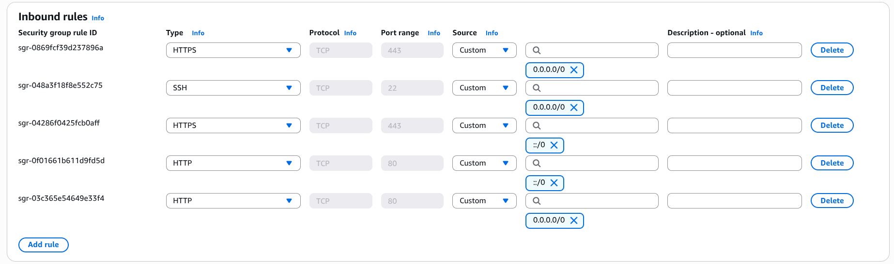
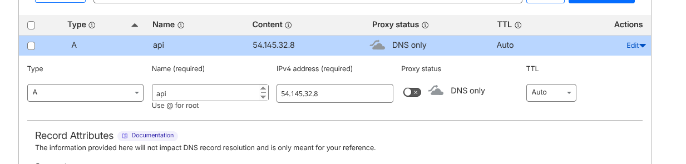
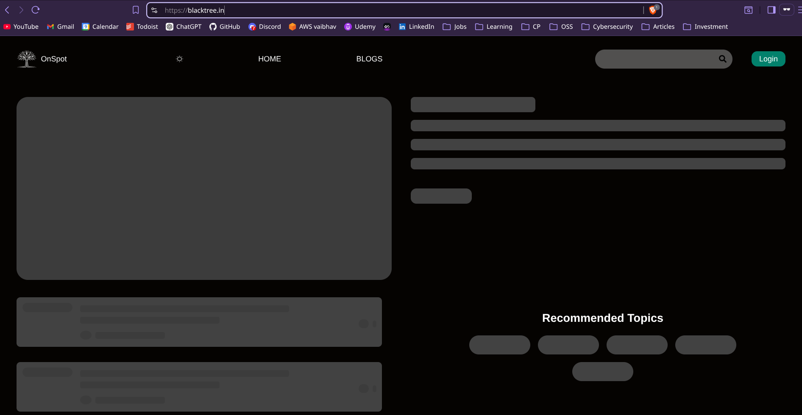
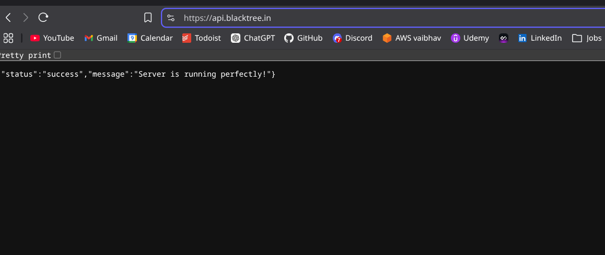

# Deployment Guide

## Demo

- **Frontend**: https://blacktree.in
- **Backend**: https://api.blacktree.in

#### Tech Stack

| Component  | Technology     | Port |
|-----------|---------------|------|
| Frontend  | Vite + React  | 3000 |
| Backend   | Express.js    | 8000 |
| Database  | MongoDB       | Internal (not publicly exposed) |

---

## Requirements

- Full-stack application repository: https://github.com/vky5/onspot
- AWS EC2 instance (Ubuntu)
- Domain name (e.g., `blacktree.in`)
- Cloudflare account (for DNS management)

---

## Step 1: Create Security Group and Key Pair

We'll set up a security group with the following inbound rules:
- **Port 22** (SSH)
- **Port 80** (HTTP)
- **Port 443** (HTTPS)

We need all three because Certbot requires port 80 for validation, Nginx listens on 80 before redirecting to HTTPS, and SSH gives us instance access. We can restrict SSH to our IP only for tighter security.

Then create a key pair for SSH access and download the `.pem` file.



---

## Step 2: Launch EC2 Instance

Pick Ubuntu AMI on a t2.micro (free tier). Attach the security group and key pair we just created, and make sure public IP is enabled.

---

## Step 3: Install Docker

Start by updating the package index:

```bash
sudo apt update
```

Install Docker:

```bash
sudo apt install docker.io -y
```

Start and enable Docker:

```bash
sudo systemctl start docker
sudo systemctl enable docker
```

Check the installation:

```bash
docker --version
```

Add the current user to the Docker group so we don't need sudo every time:

```bash
sudo usermod -aG docker ubuntu
```

Then logout and SSH back in:

```bash
exit
ssh -i onspot-prod ubuntu@<EC2-IP>
```

Verify Docker works without sudo:

```bash
docker ps
```

> **Note:** We need to re-login for the Docker group permissions to apply.

---

## Step 4: Clone Repository and Run Containers

Clone the project:

```bash
git clone https://github.com/vky5/onspot.git
cd onspot
```

#### Create Environment Files

> **Important:** `.env` files aren't in the repo for security reasons, so we'll create them manually before running the containers.

Fire up all the services with Docker Compose:

```bash
docker compose up -d --build
```

Check what's running:

```bash
docker ps
```

We'll see three containers:
- **frontend** (port 3000)
- **backend** (port 8000)
- **mongodb** (internal)

#### Test services locally

From the EC2 instance:

```bash
curl http://localhost:3000
curl http://localhost:8000
docker logs backend
```

If both respond, we're good to go.

> **Note:** MongoDB isn't exposed publicly. The backend connects to it through the Docker network at `mongodb:27017`.

---

## Step 5: Configure Domain (DNS)

Head over to Cloudflare and add these DNS records:

#### Root domain (frontend)

```text
Type: A
Name: @
Value: <EC2-PUBLIC-IP>
Proxy: OFF (DNS only)
```



This maps `blacktree.in` to the EC2 instance.

#### Subdomain (backend API)

```text
Type: A
Name: api
Value: <EC2-PUBLIC-IP>
Proxy: OFF (DNS only)
```

This maps `api.blacktree.in` to the EC2 instance.

#### Verify DNS

Run:

```bash
curl http://blacktree.in
curl http://api.blacktree.in
```

Both should reach the EC2 instance.

> **Note:** We're keeping the proxy OFF for now. Certbot's HTTP validation can fail when Cloudflare's proxy is active, so we'll enable it after SSL is configured.

---

## Step 6: Configure Nginx (Reverse Proxy)

Install Nginx:

```bash
sudo apt update
sudo apt install nginx -y
```

Start and enable it:

```bash
sudo systemctl start nginx
sudo systemctl enable nginx
```

#### Set up Reverse Proxy

Edit the default config:

```bash
sudo nano /etc/nginx/sites-available/default
```

Replace it with:

```nginx
server {
    listen 80;
    server_name blacktree.in www.blacktree.in;

    location / {
        proxy_pass http://localhost:3000;
        proxy_set_header Host $host;
        proxy_set_header X-Real-IP $remote_addr;
    }
}

server {
    listen 80;
    server_name api.blacktree.in;

    location / {
        proxy_pass http://localhost:8000;
        proxy_set_header Host $host;
        proxy_set_header X-Real-IP $remote_addr;
    }
}
```

Test the config:

```bash
sudo nginx -t
```

Restart Nginx:

```bash
sudo systemctl restart nginx
```

#### Verify

Open in browser:
- http://blacktree.in → Frontend
- http://api.blacktree.in → Backend

---

## Step 7: Enable HTTPS using Certbot

Install Certbot and the Nginx plugin:

```bash
sudo apt update
sudo apt install certbot python3-certbot-nginx -y
```

#### Generate SSL Certificates

Run:

```bash
sudo certbot --nginx
```

#### Follow the prompts

- Enter email address
- Agree to terms
- Select the domains: `blacktree.in` and `api.blacktree.in`

#### Enable HTTPS redirect

Pick the option to redirect HTTP to HTTPS.

#### Verify HTTPS

Open in browser:
- https://blacktree.in
- https://api.blacktree.in

We should see the secure connection (🔒).

#### Test auto-renewal

```bash
sudo certbot renew --dry-run
```

#### What we get

- All traffic served over HTTPS
- Certificates auto-renew
- Nginx updated with SSL config

---

## Hardening

We're running a pretty tight setup, but there are a few extra steps worth calling out:

#### Cloudflare Proxy

Once SSL is configured, we can enable Cloudflare's proxy in the DNS dashboard. This means:
- The real EC2 IP stays hidden behind Cloudflare's edge servers
- Cloudflare provides basic DDoS protection and request filtering
- We get CDN caching at the edge for faster loads
- WAF rules block common attack patterns automatically

> **Note:** We kept the proxy OFF during SSL setup so Certbot's HTTP validation wouldn't fail. We can switch it on now.

#### Locking Down the Security Group

We expose ports 22, 80, and 443, but we can tighten this up:
- Restrict SSH (22) to our IP only — no need to leave it open to the world
- Port 80 is needed for HTTP → HTTPS redirect
- Port 443 handles all encrypted traffic

Nginx acts as a single entry point here, routing requests to the right container and preventing direct access to application services.

#### Principle of Least Privilege

The backend connects to MongoDB with minimal permissions, and we're not storing admin credentials in any `.env` files. If something goes wrong, the blast radius stays contained.

#### Environment Files

The `.env` files aren't committed to the repo. Here's what they look like:

**Backend:** `/backend/.env`
```env
NODE_ENV='production'
PORT=8000
DB_URL='mongodb://mongodb:27017/onspot'
JWT_SECRET='your-secret-here'
FRONTEND_URL='http://localhost:3000'
```

**Frontend:** `/frontend/.env`
```env
VITE_BACKEND_URL='http://backend:8000/api/v1'
VITE_GOOGLE_CLIENT_ID='your-google-client-id'
```

---

## Request Flow

Here's how a request moves through the system:

```
User → Cloudflare → EC2 → Nginx → Service → MongoDB
```

Nginx sits in front of everything, routing based on the domain name. The user never talks directly to the application containers, and MongoDB only accepts connections from the Docker network.

---

## Final Result




