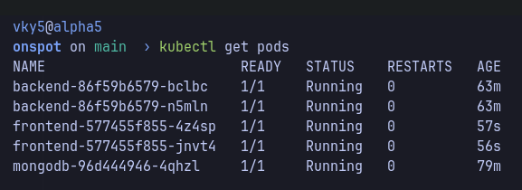

# Kubernetes Deployment on Minikube

This project showcases how I deployed a full-stack application (React + Express + MongoDB) on Kubernetes using Minikube.

The focus was not only to run containers, but to model the system with clear Kubernetes boundaries, secure configuration handling, persistent storage, and ingress-based routing.

---

## Architecture

```text
Browser → Ingress → Service → Pod → MongoDB
```

| Component | Kubernetes Resources | Exposure |
| --------- | -------------------- | -------- |
| Frontend  | Deployment + Service | Ingress (primary), NodePort (debug) |
| Backend   | Deployment + Service + ConfigMap + Secret | Ingress |
| MongoDB   | Deployment + PV + PVC + Service | Internal only (ClusterIP) |

MongoDB stays private inside the cluster, while only application-facing services are exposed externally.

---

## Runtime Strategy

The cluster runs on Minikube, and I build images directly inside Minikube's Docker environment:

```bash
eval $(minikube docker-env)
```

This avoids a remote registry and allows Kubernetes to use local images with:

```text
imagePullPolicy: Never
```

---

## Resource Design

### MongoDB (Stateful Layer)

MongoDB is deployed with persistence using:

* PersistentVolume
* PersistentVolumeClaim

Files:

* [k8s/mongodb/pv.yaml](k8s/mongodb/pv.yaml)
* [k8s/mongodb/pvc.yaml](k8s/mongodb/pvc.yaml)
* [k8s/mongodb/mongodb-deployment.yaml](k8s/mongodb/mongodb-deployment.yaml)
* [k8s/mongodb/mongodb-service.yaml](k8s/mongodb/mongodb-service.yaml)

The database is exposed only via a ClusterIP service and accessed internally using service DNS (`mongodb`).

---

### Backend (Stateless Layer)

The backend is deployed with 2 replicas and uses:

* ConfigMap → non-sensitive config
* Secret → sensitive values (JWT, email credentials)

Files:

* [k8s/backend/configmap.yaml](k8s/backend/configmap.yaml)
* [k8s/backend/secrets.yaml](k8s/backend/secrets.yaml)
* [k8s/backend/backend-deployment.yaml](k8s/backend/backend-deployment.yaml)
* [k8s/backend/backend-service.yaml](k8s/backend/backend-service.yaml)

Environment variables are injected at runtime, allowing backend configuration without rebuilding images.

---

### Frontend (Static Layer)

The frontend is built using Vite and served as static assets.

Files:

* [k8s/frontend/frontend-deployment.yaml](k8s/frontend/frontend-deployment.yaml)
* [k8s/frontend/frontend-service.yaml](k8s/frontend/frontend-service.yaml)

Important detail:

> Frontend configuration is baked at build time. Unlike the backend, it does not consume ConfigMaps dynamically.

---

## Networking Strategy

Initially, I exposed services using NodePort for quick validation.

After that, I moved to Ingress-based routing for cleaner architecture.

Ingress configuration:

* `app.local` -> frontend
* `/api` path -> backend

Ingress manifest:

* [k8s/ingress.yaml](k8s/ingress.yaml)

This removes the need to hardcode backend URLs in the frontend.

### Key Improvement

Instead of using:

```text
http://<minikube-ip>:30007
```

the frontend calls:

```text
/api
```

Ingress handles routing to the backend service.

This decouples frontend from backend service location and avoids rebuilds when backend endpoints change.

---

## Deployment Workflow

I applied resources in dependency order:

1. Storage (PV + PVC)
2. MongoDB
3. Backend (ConfigMap + Secret + Deployment)
4. Frontend
5. Ingress

Manifest bundle used in deployment:

* [k8s/mongodb/pv.yaml](k8s/mongodb/pv.yaml)
* [k8s/mongodb/pvc.yaml](k8s/mongodb/pvc.yaml)
* [k8s/mongodb/mongodb-deployment.yaml](k8s/mongodb/mongodb-deployment.yaml)
* [k8s/mongodb/mongodb-service.yaml](k8s/mongodb/mongodb-service.yaml)
* [k8s/backend/configmap.yaml](k8s/backend/configmap.yaml)
* [k8s/backend/secrets.yaml](k8s/backend/secrets.yaml)
* [k8s/backend/backend-deployment.yaml](k8s/backend/backend-deployment.yaml)
* [k8s/backend/backend-service.yaml](k8s/backend/backend-service.yaml)
* [k8s/frontend/frontend-deployment.yaml](k8s/frontend/frontend-deployment.yaml)
* [k8s/frontend/frontend-service.yaml](k8s/frontend/frontend-service.yaml)
* [k8s/ingress.yaml](k8s/ingress.yaml)

Commands used:

```bash
minikube start
minikube addons enable ingress

eval $(minikube docker-env)
docker build -t backend:latest ./backend
docker build -t frontend:latest ./frontend

kubectl apply -f k8s/
kubectl get all
kubectl get pv,pvc
kubectl get ingress
kubectl rollout status deployment/backend
kubectl rollout status deployment/frontend
```

---

## Validation

I validated:

* Pods reached `Running` and `Ready`
* PVC successfully bound to PV
* Backend connected to MongoDB via internal DNS
* Ingress routed traffic correctly based on host and path
* Frontend successfully called backend using `/api` (no hardcoded URL)

---

## Request Flow

### NodePort (debug)

```text
Browser → MinikubeIP:30008 → frontend → backend → mongodb
```

### Ingress (final)

```text
Browser → app.local
        → / → frontend
        → /api → backend → mongodb
```

---

## Tradeoffs and Limitations

* Single-node cluster (Minikube)
* MongoDB uses Deployment instead of StatefulSet (simplified setup)
* hostPath storage (not production-grade)
* No TLS/HTTPS
* No autoscaling

---

## Notes

* Backend configuration is dynamic (ConfigMap/Secret)
* Frontend configuration is static (build-time, Vite)
* Ingress-based routing removes dependency on backend URLs

---

## Summary

This setup demonstrates:

* Service isolation using Kubernetes primitives
* Proper separation of config and secrets
* Internal vs external service exposure
* Persistent storage for stateful workloads
* Ingress-based routing for clean architecture